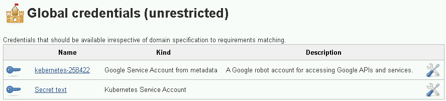
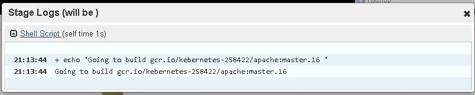
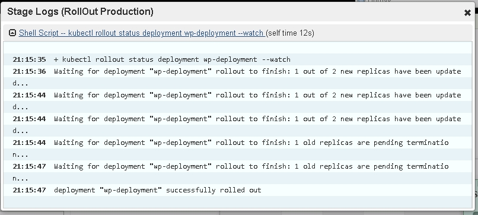
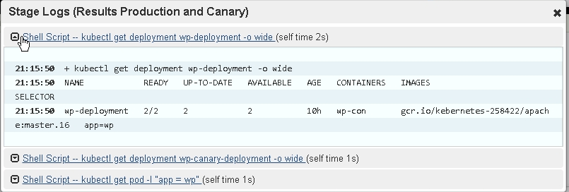
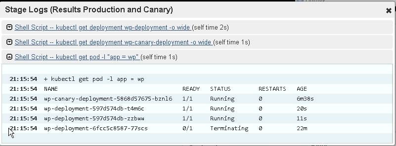

# Exercise. Build a Continuous Deployment Pipeline with Jenkins and Kubernetes (GKE).  
## Before begin.  
This is a addition to [Exercise_1](https://github.com/r-mamchur/GKE_Exercise_1).  
Copy/Paste of part of that repository isn't good idea.  
So, you can use ***`kube-conf`*** generated there  
or download the credentials for your cluster using the [gcloud CLI](https://cloud.google.com/sdk/):  
```shell
gcloud container clusters get-credentials jennifer
Fetching cluster endpoint and auth data.
kubeconfig entry generated for jennifer.
```
## Install Jenkins.  
Use the Helm CLI to deploy the chart with configuration set.  
```shell
helm install cd --values jenkins-values.yaml stable/jenkins --kubeconfig="./kube-conf"
```  
Serviceaccount ***`cd-jenkins`*** was created.  
Grant it the cluster-admin role in your cluster:
```shell
kubectl create clusterrolebinding jenkins-admin --clusterrole=cluster-admin --serviceaccount=default:cd-jenkins --kubeconfig="./kube-conf"
```  
Service.type LoadBalancer was created. 
Connect to ***Jenkins-UI***: ***`admin/admin`***.

## Run Jenkins.
Add credentials.  
Kinds: ***`'Google Service Account from metadata'`*** and ***`'Kubernetes Service Account'`***  


Jenkins build new image and deploy it.  
Deploy only WordPress image.  
I'm using ***Jenkinsfile*** from this repo but ***dokerfile*** from [Exercise_1](https://github.com/r-mamchur/GKE_Exercise_1).  
Modify the ***Jenkinsfile*** script so it contains the correct ***`<Project-Id>`***.  

There are 2 different releases: ***`simple.jenkins`*** and ***`multibranch.jenkins`***.

## simple.jenkins 
It build new image and ***Set*** it to ***WP-deployment***.  
K8s will deploy new image.  

## multibranch.jenkins
Script build and deploy images after commit on different branches:  
***`master`*** - default namespace, this is inherit from [Exercise_1](https://github.com/r-mamchur/GKE_Exercise_1)
***`Canary`*** - deploy in ***wp-canary-deployment***.  
***`Other`*** branches - build in ***Test*** namespace.  

Merge this repo to repo [Exercise_1](https://github.com/r-mamchur/GKE_Exercise_1).

### Preparing environment. 
##### Canary. 
```shell
kubectl create -f ./yaml/wp-canary-deployment.yaml --kubeconfig="./kube-conf"
```  
***Label*** for ***service selector*** is same as product WP then ***LoadBalanser*** will periodically redirect to ***canary*** (3:1).  

##### **`'Test'`** environment.
```shell
# NameSpace
kubectl create -f ./yaml/ns_test.yaml  --kubeconfig="./kube-conf"
# Persistent Volume Claims
kubectl --namespace=test create -f ./yaml/dp_pvc_all.yaml --kubeconfig="./kube-conf"
# secret wp-conf.php
kubectl create secret generic wp-conf --from-file=wp-config.php --namespace=test --kubeconfig="./kube-conf"
# Initial WordPress
kubectl --namespace=test create -f ./yaml/wp-initial_job.yaml --kubeconfig="./kube-conf"
# Deployment
kubectl --namespace=test create -f ./yaml/wp-deployment.yaml --kubeconfig="./kube-conf"
# scale to 1 replica
kubectl scale deployment wp-deployment --replicas=1 --namespace=test --kubeconfig="./kube-conf"
# LoadBalanser
kubectl --namespace=test create -f ./yaml/wp-svc-loadbalancer.yaml --kubeconfig="./kube-conf"
```
### Jenkins CD.
Example after ***Master branch*** commit/push.  
##### Stages:
 ***Will be*** - tag of new image  

 ***RollOut*** - deployment process  

 ***Result*** - 
  Done. Make sure, this is image from stage ***'Will be'***.

  
  ***'AGE' pods*** - new pods are running, old pods are terminating and ***Canary*** pod is old.


##### Been used:
* [https://github.com/GoogleCloudPlatform/continuous-deployment-on-kubernetes](https://github.com/GoogleCloudPlatform/continuous-deployment-on-kubernetes)  
* [https://cloud.google.com/solutions/jenkins-on-kubernetes-engine-tutorial](https://cloud.google.com/solutions/jenkins-on-kubernetes-engine-tutorial)  
* [https://cloud.google.com/solutions/jenkins-on-kubernetes-engine](https://cloud.google.com/solutions/jenkins-on-kubernetes-engine)  
* [https://github.com/helm/charts/blob/28250ead2088bb36831864f43648d94dfee4f618/stable/jenkins/values.yaml](https://github.com/helm/charts/blob/28250ead2088bb36831864f43648d94dfee4f618/stable/jenkins/values.yaml)  
* [https://github.com/jenkinsci/google-oauth-plugin/blob/develop/docs/home.md](https://github.com/jenkinsci/google-oauth-plugin/blob/develop/docs/home.md)


